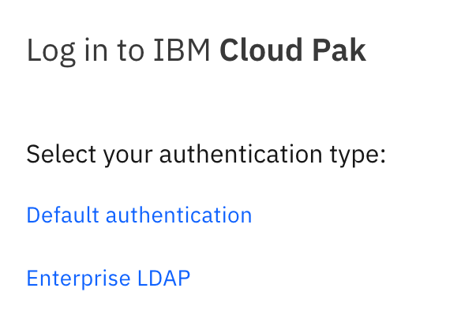
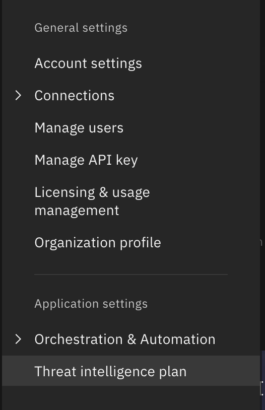
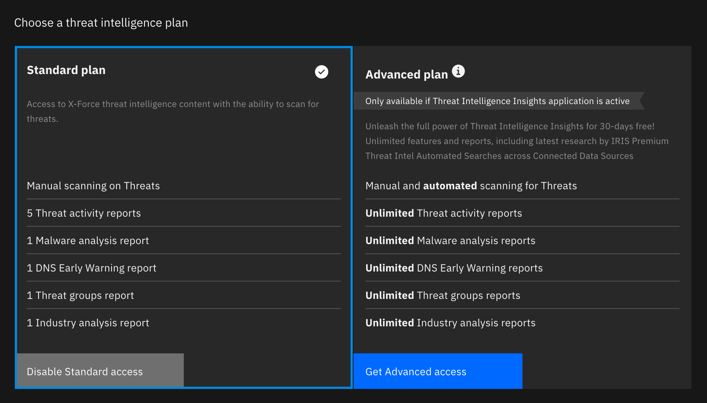
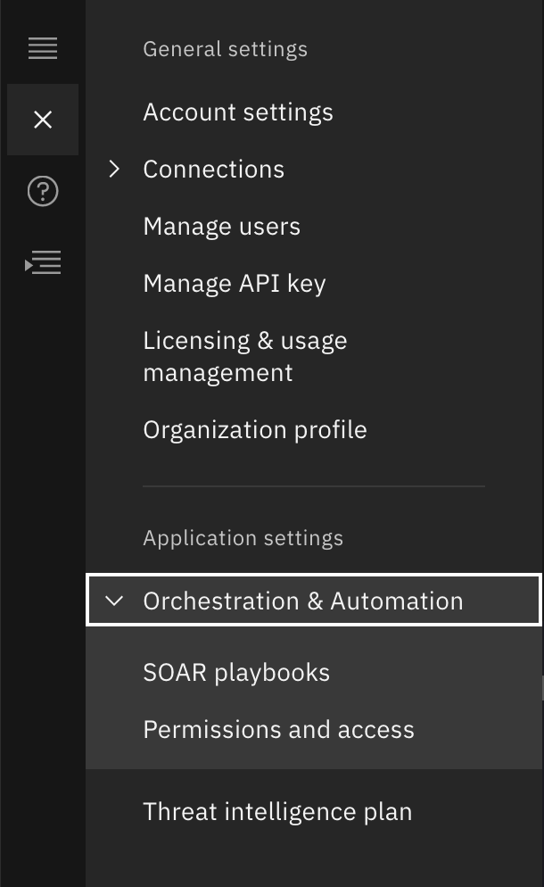
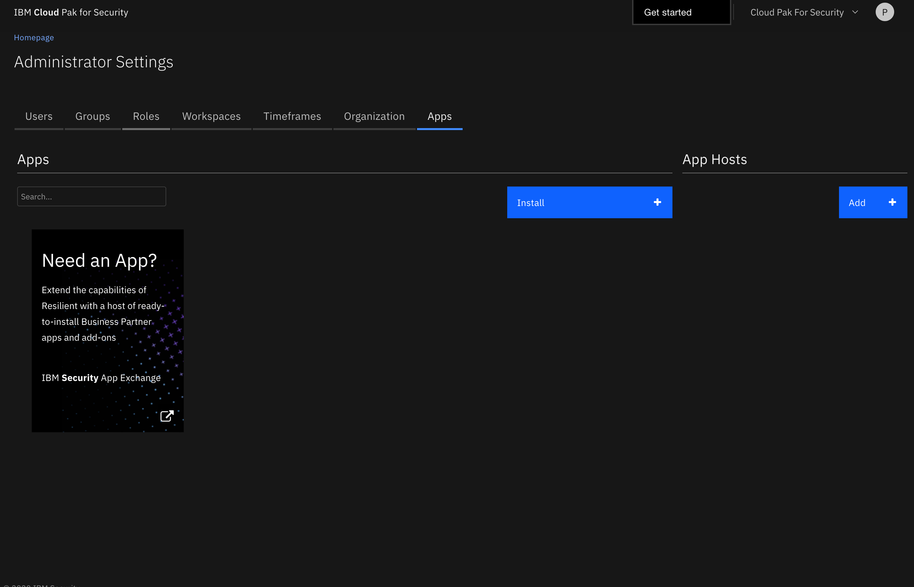

// Add steps as necessary for accessing the software, post-configuration, and testing. Don’t include full usage instructions for your software, but add links to your product documentation for that information.
//Should any sections not be applicable, remove them

== Test the deployment
// If steps are required to test the deployment, add them here. If not, remove the heading

1. Logging into the {partner-product-short-name} Console
  
Navigate to the CPSFQDN specified for the {partner-product-name} deployment parameters.

Select _Default authentication_

  
Use the name _platform-admin_ with the specified {partner-product-short-name} UI password.
  
image::../images/2.png[image_placeholder]

== Post deployment steps
// If Post-deployment steps are required, add them here. If not, remove the heading

1. Activate the Orchestration & Automation

See reference here: https://www.ibm.com/support/knowledgecenter/en/SSTDPP_1.4.0/platform/docs/security-pak/app_licensereq.html

2. Activate X-Force Threat Intelligence Insights

Open the settings menu (Left menu bar)
  

Select _Threat intelligence plan_

Select your package and see onboard references and prompts to apply your X-Force API key to activate the feature
  

3. Install third party applications & AppHost

Select Orchestration & Administration > Permissions and access > Apps
  

  

== Best practices for using {partner-product-short-name} on AWS
// Provide post-deployment best practices for using the technology on AWS, including considerations such as migrating data, backups, ensuring high performance, high availability, etc. Link to software documentation for detailed information.

== Security
// Provide post-deployment best practices for using the technology on AWS, including considerations such as migrating data, backups, ensuring high performance, high availability, etc. Link to software documentation for detailed information.

{partner-product-name} connects to various data sources using _data connectors_ it is in your best interest to ensure that only trusted priveleged users have access to both the data sources on the {partner-product-short-name} console or the OpenShift console.

== Other useful information
//Provide any other information of interest to users, especially focusing on areas where AWS or cloud usage differs from on-premises usage.

{partner-product-name} has a simple static LDAP (openLDAP and phpLDAPadmin) configured user system. We reccomend that you connect your own LDAP server to IBM Common Services to better support your long term use of the product. For further assistance please see: https://www.ibm.com/support/knowledgecenter/en/SSTDPP_1.4.0/platform/docs/security-pak/ldap-connect.html
