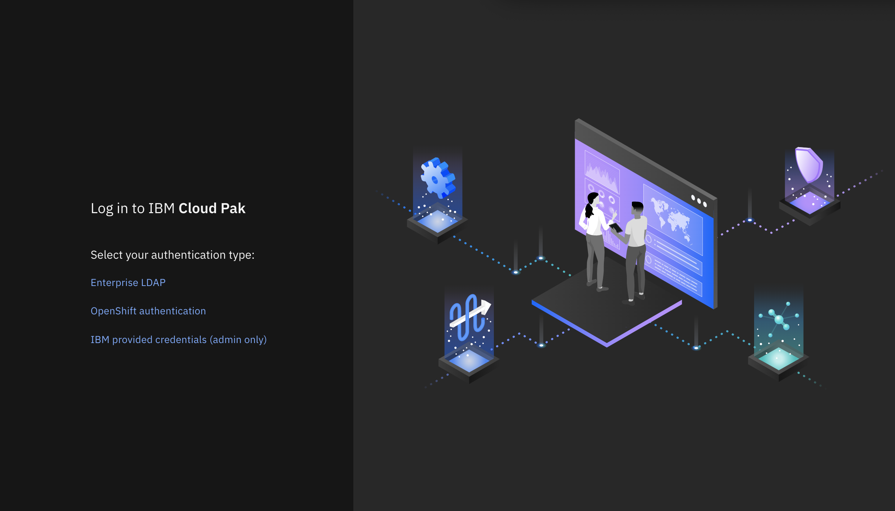
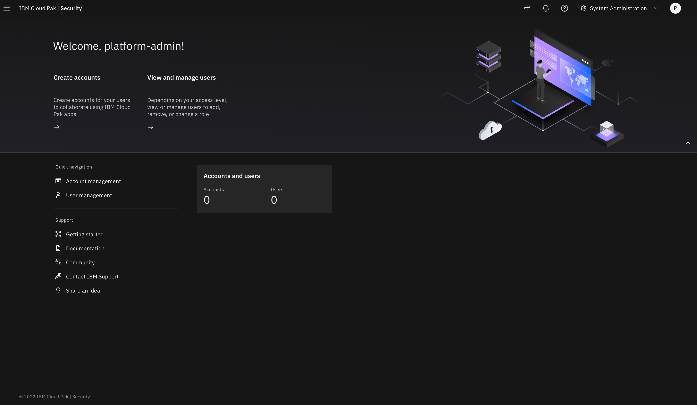
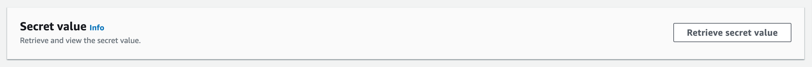

// Add steps as necessary for accessing the software, post-configuration, and testing. Don’t include full usage instructions for your software, but add links to your product documentation for that information.
//Should any sections not be applicable, remove them

== Post deployment steps 

=== Configuring Identity Provider authentication

To log in to {partner-product-name}, you must configure at least one Identity Provider (IDP). The *CP4SAdminUser*, shown in <<_cfn_outputs>>, that you provided while creating the stack must exist in the choosen Identity Provider (IDP). This *CP4SAdminUser* is the initial user who can log in and add other users. Use the password that you specified for the user when you configured the Identity Provider (IDP). To know more details on configuring Identity Provider (IDP) authentication, see the {partner-product-name} documentation on https://www.ibm.com/docs/en/cloud-paks/cp-security/1.9?topic=postinstallation-configuring-identity-providers[Configuring Identity Provider Authentication^].

=== Login into {partner-product-name}

After configuring at least one Identity Provider (IDP) navigate to the *CP4SWebClientURL* output of the root stack, shown in <<_cfn_outputs>>.

Log in to the {partner-product-name} web client by choosing *Enterprise LDAP* authentication, and then enter the *CP4SAdminUser* value and the admin password that you supplied while configuring LDAP authentication during post installation.

[#_icp4s_login_page]
.Login page for {partner-product-short-name} web client
[link=images/ibm-cloud-pak-for-security-login-page.png]

{empty} +
Upon logging in to the {partner-product-name} web client URL, the welcome page opens for the System Administrator account, as shown in <<_icp4s_welcome_page>>.

[#_icp4s_welcome_page]
.Welcome page for {partner-product-short-name} web client
[link=images/ibm-cloud-pak-security-admin-welcome-page.png]

=== Create accounts in {partner-product-name}

As a system administrator, you can create Standard or Provider accounts in IBM Cloud Pak for Security, or delete existing accounts. You must be working in the System Administration account and have the required permission to manage accounts. For more details, see the {partner-product-name} documentation on https://www.ibm.com/docs/en/cloud-paks/cp-security/1.9?topic=administration-creating-deleting-accounts[Creating or Deleting Accounts^].

=== Configure a data source connection

To begin working with applications, enable {partner-product-name} to connect with data sources. For more details, see the {partner-product-name} documentation on https://www.ibm.com/docs/en/cloud-paks/cp-security/1.9?topic=configuring-universal-data-insights-connectors[Configuring a Data Source Connection^].

== Other useful information

=== Manage your cluster using the Red Hat OpenShift web console

To access the Red Hat Openshift Container Platform web console, navigate to the *OpenshiftWebConsoleURL* in the `Outputs` tab of the root stack. See, <<_cfn_outputs>>.

Log in to the Openshift web console by using use the default OpenShift administrator *kubeadmin*. The password can be obtained from the *OpenShiftSecret* resource from the `Resources` tab of IBM Cloud Pak for Security stack.

.OpenShift secret resource
[link=images/oc-secret-resource.png]
image::../images/oc-secret-resource.png[OpenShift secret resource]

{empty} +
You can retrieve the secret value by choosing `Retrieve secret value`, as shown in the figure below. Use this secret value as OpenShift console administrative password.

.Retrieve secret value for console password
[link=images/retrieve-secret.png]

=== Accessing Red Hat OpenShift cluster from the command-line interface

In your Red Hat OpenShift web console, click your profile name and then click `Copy Login`.
Click `Display Token`, copy the oc login command, and paste the command into your command line.