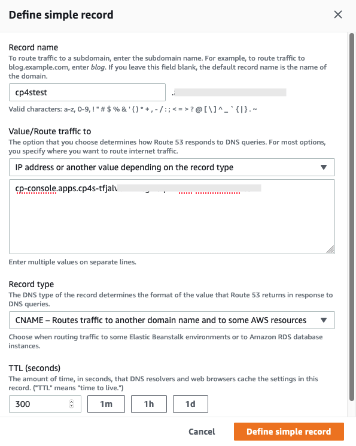
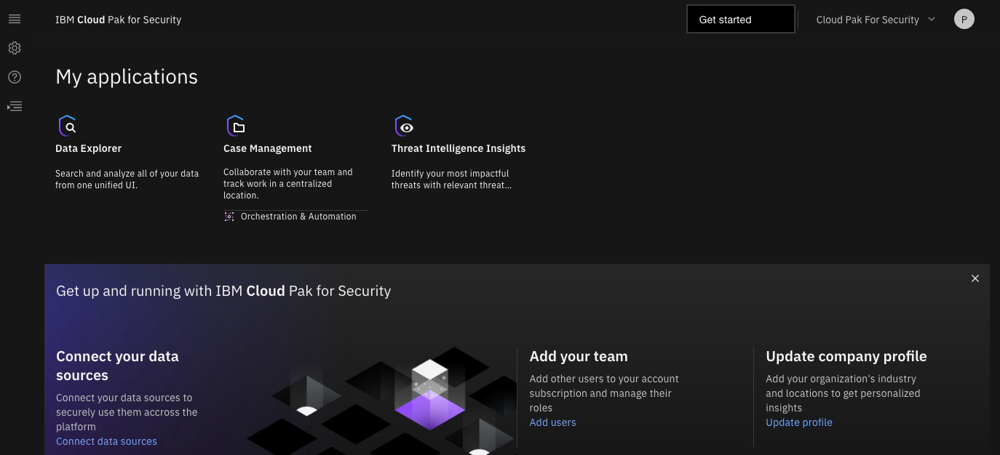

// Add steps as necessary for accessing the software, post-configuration, and testing. Don’t include full usage instructions for your software, but add links to your product documentation for that information.
//Should any sections not be applicable, remove them

== Create DNS record
Before you can test the deployment, you need to add one DNS record to your hosted zone in Amazon Route 53. Go to Amazon Route 53 console,
choose the hosted zone corresponding to  the domain name that you specified as the `DomainName` parameter. Choose *Create Record*,
then pick Simple routing policy, then choose *Define simple record* as shown in <<postDeploy1>>.

. The record name must match the `CPSFQDN` parameter input you passed when creating the stack.
. The record type should be a CNAME.
. The value of the record should be `cp-console.apps.ClusterName.DomainName`, where `ClusterName` and `DomainName` were passed as input parameters.
+
:xrefstyle: short
[#postDeploy1]
.Create DNS record for `CPSFQDN` parameter
[link=images/create-dns-record.png]

== Test the deployment

. After you have completed the link:#_create_dns_record[create DNS record step] above, navigate to the *CP4SWebClientURL* output of the root stack as shown in <<cfn_outputs>>.
. A new tab opens in your browser. You see either the {partner-product-short-name} web client login page or a warning from your browser that the HTTPS connection is not safe. By default, the public key infrastructure (PKI) certificate that is created for the {partner-product-short-name} cluster is self-signed, which causes the unsafe connection warning from your browser.
. Log in to the {partner-product-short-name} web client by choosing *Default authentication*, and then using the default user `platform-admin` and the admin password you supplied when creating the stack. If you did not supply a password, you can retrieve it from the *CP4SSecret* secret stored in AWS Secrets Manager.
. Once you log in, the welcome page is displayed as shown in <<testStep1>>.
+
:xrefstyle: short
[#testStep1]
.Welcome page for {partner-product-short-name} web client
[link=images/cloud-pak-security-welcome-page.png]

== Post deployment steps
//TODO This section doesn't look very coherent, unless Steps 1, 2, and 3 below are what all users are expected to do in sequence. Even if so, I'd prefer if you descriptively write them at a high level. However, my recommendation is to simply link to a IBM web page that has all the post-installation details.
// If Post-deployment steps are required, add them here. If not, remove the heading

. Activate the Orchestration & Automation

See reference here: https://www.ibm.com/support/knowledgecenter/en/SSTDPP_1.4.0/platform/docs/security-pak/app_licensereq.html

. Activate X-Force Threat Intelligence Insights

Open the settings menu (Left menu bar)
  
image::../images/3.png[image_placeholder]

Select _Threat intelligence plan_

image::../images/4.png[image_placeholder]

Select your package and see onboard references and prompts to apply your X-Force API key to activate the feature
  
image::../images/5.png[image_placeholder]

. Install third party applications & AppHost

Select Orchestration & Administration > Permissions and access > Apps
  
image::../images/6.png[image_placeholder]
  
image::../images/7.png[image_placeholder]

== Security
// Provide post-deployment best practices for using the technology on AWS, including considerations such as migrating data, backups, ensuring high performance, high availability, etc. Link to software documentation for detailed information.

{partner-product-name} connects to various data sources using _data connectors_ it is in your best interest to ensure that only trusted priveleged users have access to both the data sources on the {partner-product-short-name} console or the OpenShift console.

== Other useful information
//Provide any other information of interest to users, especially focusing on areas where AWS or cloud usage differs from on-premises usage.

{partner-product-name} has a simple static LDAP (openLDAP and phpLDAPadmin) configured user system. We recommend that you connect your own LDAP server to IBM Common Services to better support your long term use of the product. For further assistance please see https://www.ibm.com/support/knowledgecenter/en/SSTDPP_1.4.0/platform/docs/security-pak/ldap-connect.html[Configuration LDAP authentication^] for details.
