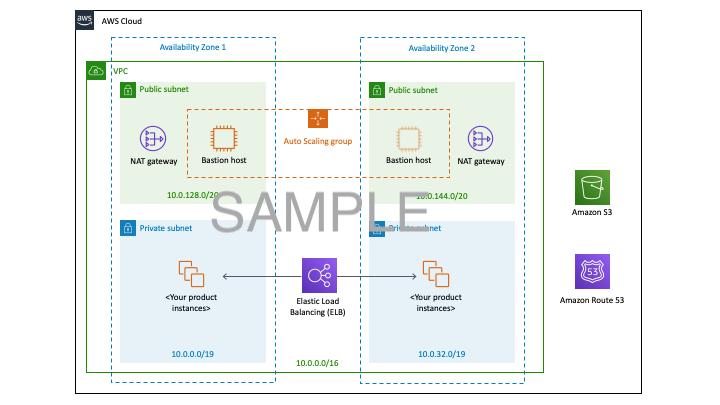

Deploying this Quick Start for a new virtual private cloud (VPC) with
default parameters builds the following _{partner-product-short-name}_ environment in the
AWS Cloud.

// Replace this example diagram with your own. Send us your source PowerPoint file. Be sure to follow our guidelines here : http://(we should include these points on our contributors giude)
:xrefstyle: short
[#architecture1]
.Quick Start architecture for _{partner-product-short-name}_ on AWS
[link=images/architecture_diagram.png]

As shown in Figure 1, the Quick Start sets up the following:

//TODO Verifying bullets from IBM
* A highly available architecture that spans one or three Availability Zones.*
* A VPC configured with public and private subnets, according to AWS
best practices, to provide you with your own virtual network on AWS.*
* In the public subnets:
  ** Managed network address translation (NAT) gateways to allow outbound
internet access for resources in the private subnets.*
  ** A Linux bastion host in an Auto Scaling group to allow inbound Secure
Shell (SSH) access to EC2 instances in public and private subnets.*
* In the private subnets:
  ** OpenShift Container Platform (OCP) master nodes in up to three Availability Zones
  ** OCP compute nodes that host the {partner-product-short-name} capabilities
  ** Elastic Block Storage disks that are mounted on the compute nodes for container persistent data
* A Classic Load Balancer spanning the public subnets for accessing {partner-product-short-name} from a web browser.
* A Network Load Balancer spanning the public subnets for routing external OpenShift application programming interface (API) traffic to the OCP master instances.
* A Network Load Balancer spanning the private subnets for routing internal OpenShift application programming interface (API) traffic to the OCP master instances.
* Amazon Route 53 as your public Domain Name System (DNS) for resolving domain names of the IBM {partner-product-short-name} management console and applications deployed on the cluster.

*The template that deploys the Quick Start into an existing VPC skips
the components marked by asterisks and prompts you for your existing VPC
configuration.

The {partner-product-short-name} components run as containers on the OpenShift compute nodes, and build on a range of common platform and operational services that underpin all IBM Cloud Paks.